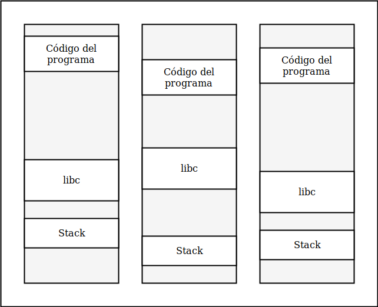
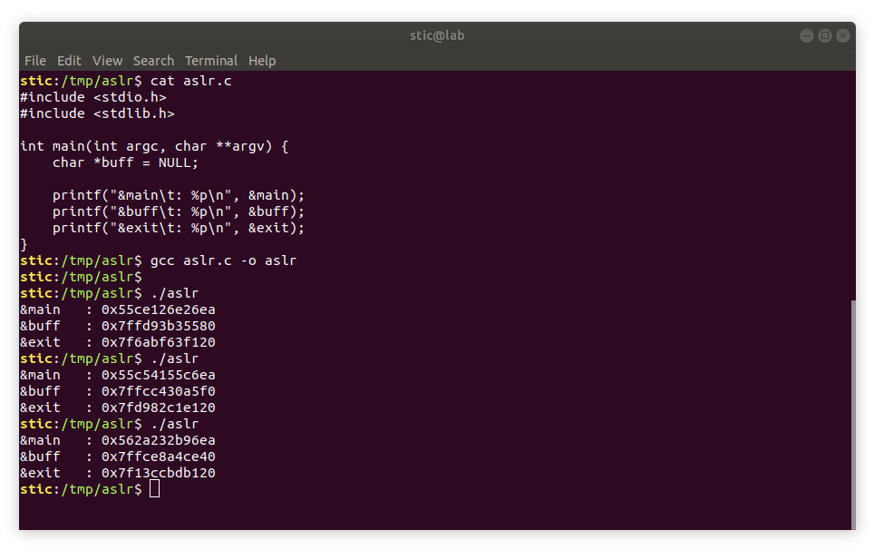
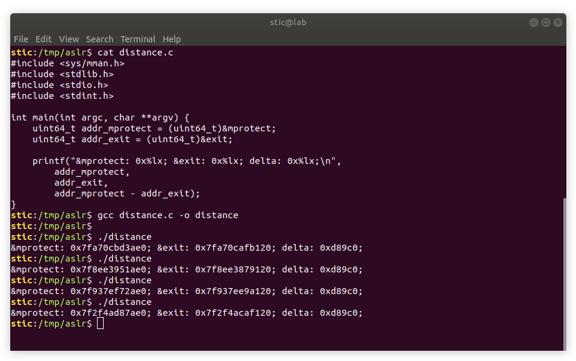
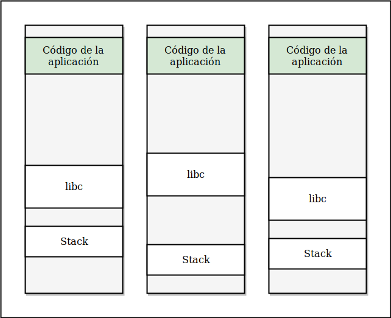
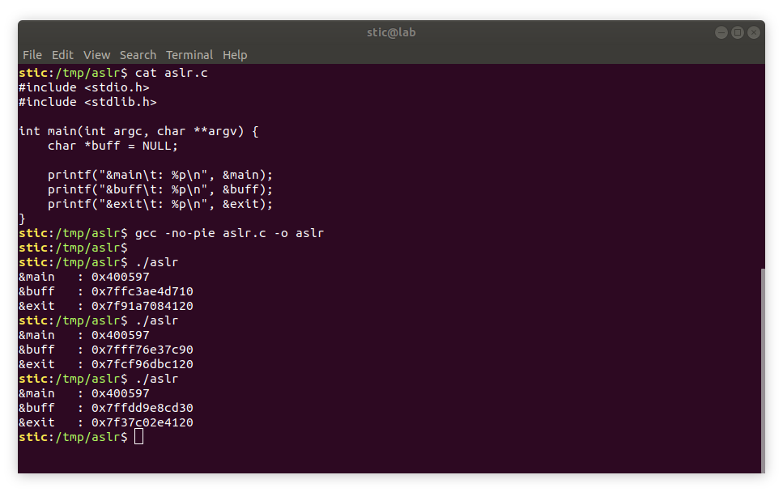

# Address Space Layout Randomization (ASLR)


Retomemos por un momento el stack overflow clásico del que veníamos hablando en los resúmenes anteriores. Como habíamos visto, para hacer efectivo el ataque, un atacante debe reemplazar alguna dirección de retorno por la dirección de algún buffer en el cuál haya inyectado shellcode. Hay que notar, sin embargo, que la efectividad del  ataque depende de la capacidad del atacante de predecir la dirección de ese buffer.

La idea de ASLR es justamente dificultar la predicción de direcciones mediante la aleatorización del espacio de memoria. Con ASLR activo, los distintos segmentos de memoria se cargan a partir de direcciones diferentes en cada ejecución. Supongamos que ejecutamos un cierto programa repetidas veces, y por cada una dibujamos un esquema del espacio de memoria. Luego, tomamos los esquemas y los ponemos uno al lado del otro para comparar la disposición de las distintas regiones. En una instalación normal de Linux podríamos observar algo como lo siguiente:




Veríamos entonces que, en ejecuciones sucesivas, los distintos segmentos de memoria se cargan a partir de direcciones diferentes. Supongamos entonces que desarrollamos un exploit en las condiciones de la izquierda (e.g. en una sesión de gdb). En tal caso, si nuestro exploit depende de direcciones absolutas, veremos que al momento de probarlo fuera del debugger muy probablemente no funcione. Incluso si en gdb vemos direcciones constantes entre ejecuciones, esto es porque gdb por defecto deshabilita la aleatorización del espacio dentro de su entorno de ejecución.


ASLR se gestiona a nivel sistema operativo. Para ver a ASLR en acción podemos usar un programa sencillo como el que se muestra a continuación:

```c
#include <stdio.h>

int main(int argc, char **argv) {
    char *buff = NULL;

    printf("&main\t: %p\n", &main);
    printf("&buff\t: %p\n", &buff);
    printf("&exit\t: %p\n", &exit);
}
```

El programa lo que hace es emitir por salida estándar las direcciones de la función main en el segmento de código del programa, de un buffer en el stack, y de la función exit en libc. Si compilamos el programa y lo ejecutamos varias veces podremos observar algo como lo siguiente:



Observaremos que, en ejecuciones sucesivas, las direcciones de los distintos elementos son efectivamente diferentes. Esto implica que cualquier exploit que dependa de direcciones hardcodeadas (no calculadas en tiempo de ejecución) muy probablemente resulte insuficiente para vulnerar sistemas que incorporan ASLR. Lo más probable es que un exploit que no incorpora las medidas adecuadas para vencer la mitigación haga al proceso objetivo finalizar con un error de segmentación o bad instruction. También cabe mencionar que ASLR puede aleatorizar las direcciones base de todos los segmentos, incluyendo el segmento de código del programa, el stack, bibliotecas externas, el heap, y otros.


#### Venciendo ASLR

Antes de proceder a estudiar los métodos para vencer a ASLR, hagamos un pequeño experimento adicional. El código del programa es el siguiente:

```c
#include <sys/mman.h>
#include <stdlib.h>
#include <stdio.h>
#include <stdint.h>

int main(int argc, char **argv) {
    uint64_t addr_mprotect = (uint64_t)&mprotect;
    uint64_t addr_exit = (uint64_t)&exit;

    printf("&mprotect: 0x%lx; &exit: 0x%lx; delta: 0x%lx;\n",
        addr_mprotect,
        addr_exit,
        addr_mprotect - addr_exit);
}
```

Este programa lo que hace es emitir por la salida estándar la **distancia en bytes** desde la función exit hacia la función mprotect en libc. ¿Cuál es la idea del experimento? Sabemos que, por el efecto de ASLR, tanto exit como mprotect serán cargadas a partir de direcciones aleatorias. Es decir, a priori no podemos predecir dónde comenzará el código de cada una de las funciones en el espacio de memoria del proceso. Observemos sin embargo lo que ocurre con la distancia entre ellas:



Observamos que, si bien las direcciones absolutas de las funciones varían en cada ejecución, la distancia de una función a otra permanece constante. Esto es razonable: en los esquemas de la sección anterior vimos que los distintos segmentos "se deslizan" en el espacio de memoria; podemos intuir, sin embargo, que los desplazamientos internos no se ven afectados.


¿Cómo podemos usar ésto para vencer a ASLR? Como habíamos visto en los ejercicios de infoleak, existen ciertas vulnerabilidades que nos permiten filtrar información sobre el espacio de memoria del proceso que estamos atacando.  Supongamos que contamos con un mecanismo de lectura independiente de direcciones absolutas (e.g. un buffer overread). Si utilizando ese mecanismo logramos leer, digamos, un puntero a una variable en el stack, tendremos efectivamente una dirección en el stack que podemos utilizar como referencia para calcular las direcciones de otros elementos cercanos. Si leemos una dirección de retorno, por otro lado, tendremos una dirección en el segmento de código del programa. Si la vulnerabilidad nos lo permite, también podemos leer hasta los primeros frames del stack, obteniendo así la dirección de __libc_start_main en libc. Con dicha dirección podemos calcular las direcciones de otras funciones de libc que nos interesen (como mprotect, por ejemplo). Si contamos con mecanismos de lectura más sofisticados también podemos intentar leer la sección de datos globales o la GOT para obtener punteros y otros datos útiles. En resumen, si explotamos las vulnerabilidades adecuadas, podemos eventualmente obtener un mapa completo del espacio de memoria del proceso. Los detalles y las distintas variantes las estaremos estudiando en ejercicios posteriores.

Aquí cabe mencionar que, evidentemente, si vamos a leer el espacio de memoria del proceso, realizar cálculos, y proveer eventualmente alguna otra entrada basada en los resultados (e.g. un exploit de ejecución de código arbitrario), es necesario contar con algún tipo de sesión interactiva con el proceso que estamos atacando. Este esquema puede servir para atacar servidores, por ejemplo, o software de alguna forma "scripteable" (e.g. un browser siendo atacado por un archivo JavaScript malicioso que abusa de alguna vulnerabilidad en el intérprete). Otros casos interesantes pueden ser el de atacar al kernel desde el espacio de usuario mediante syscalls, o el del famoso PDF maligno (PDF es un formato complejo cuyos lectores pueden incluso interpretar JavaScript).

Como nota de color, aquí cabe mencionar otra técnica que originalmente se utilizaba para vencer a ASLR: el ataque por fuerza bruta. Con la adopción de los sistemas de 64 bits, sin embargo, el ataque se volvió mucho más difícil de concretar exitosamente: las direcciones de 64 bits tienen mucha más entropía que las direcciones de 32.


#### Caso particular: binarios no PIE

Un caso interesante para mencionar es aquel de los binarios no PIE. Un PIE es un "Position Independent Executable". Dichos binarios son generados por el compilador para tener código independiente de la posición. Un binario no PIE, por otro lado, contiene código dependiente de direcciones absolutas.

Razonablemente, para ser totalmente protegido por ASLR, un proceso no puede ejecutar código dependiente de direcciones absolutas; esto implica que binarios que no son PIE no pueden ser totalmente protegidos por ASLR. Concretamente, la situacion con binarios no PIE es la siguiente:




Observamos que, en ejecuciones sucesivas, el código se carga siempre a partir de la misma dirección. Podemos comprobarlo empíricamente repitiendo el primer experimento, esta vez compilando el binario con el flag `-no-pie` de gcc.



Podemos observar que, esta vez, la función main se encuentra siempre en la misma dirección. Esto es necesario porque, para que el programa funcione correctamente, el segmento de texto debe cargarse siempre en el mismo lugar en el espacio de memoria.

¿Porqué es ésto interesante? Porque si estamos atacando un binario no pie podría no ser necesario contar con mecanismos de lectura para llevar a cabo una explotación exitosa: podría ser posible desarrollar un exploit que utilice solo fragmentos de código en la sección de texto del programa para obtener eventualmente todas las direcciones necesarias para funcionar correctamente, incluyendo direcciones en el stack y en libc. Las técnicas relevantes las estudiaremos en ejercicios posteriores.

¿Porqué alguien compilaría entonces un binario no PIE? Resulta que PIE puede tener un impacto no despreciable en el rendimiento, por lo cuál en algunos casos se prefiere dejarlo deshabilitado. Por otro lado, hoy en día los sistemas operativos ya vienen con toolchains configuradas para producir PIEs por defecto, por lo que el caso podría estar perdiendo relevancia. En cualquier caso, no está de más verificar si el binario objetivo es o no es un PIE; de no serlo, conviene tener presente que podría no ser necesario contar con primitivas de lectura para lograr un exploit robusto.