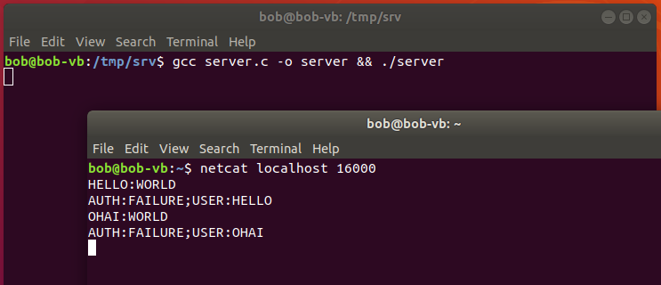

# First Boss: Docs

La idea de este documento es proveer algunos hints iniciales sobre el funcionamiento del programa objetivo.
En principio se trata de un servidor TCP que escuchará por conexiones en el puerto 16000 del host local.
La idea es la siguiente: el servidor implementa un pseudo protocolo que permite la gestión remota de un cierto sistema.
Cada usuario es dueño de sus correspondientes credenciales (nombre de usuario y contraseña), y un cierto perfil que contiene
información adicional (e.g. su nombre). Toda esta información se almacena en una base de datos ficticia del lado del server.

Habiendo establecido una conexión con el servidor será necesario enviar un mensaje de autenticación para iniciar una sesión.
El mensaje de autenticación tiene el siguiente formato:

```
<usuario>:<contraseña>\n
```
El último caracter es un salto de línea. Un ejemplo se muestra en la siguiente captura:



Para obtener más información será necesario analizar el código fuente del programa.
